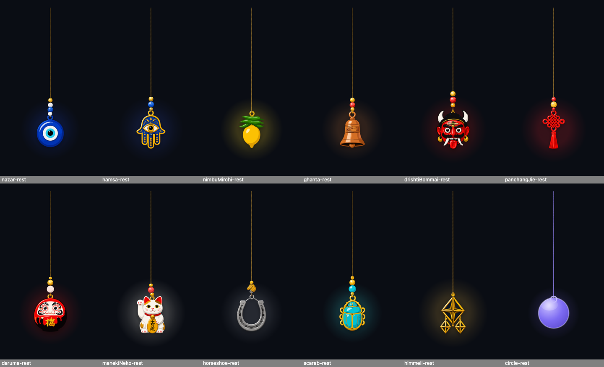
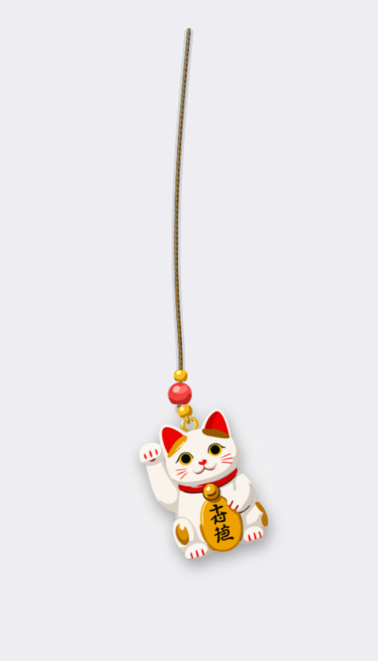
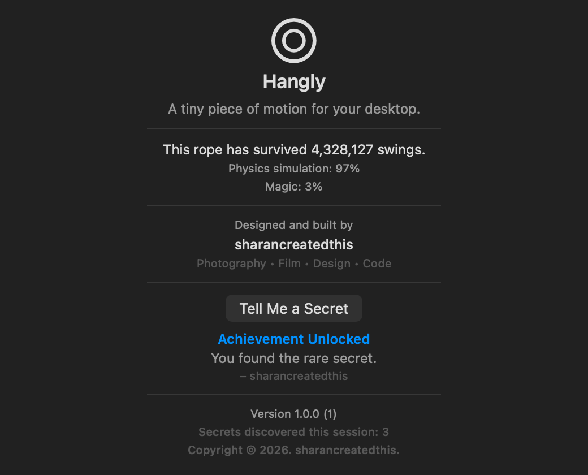
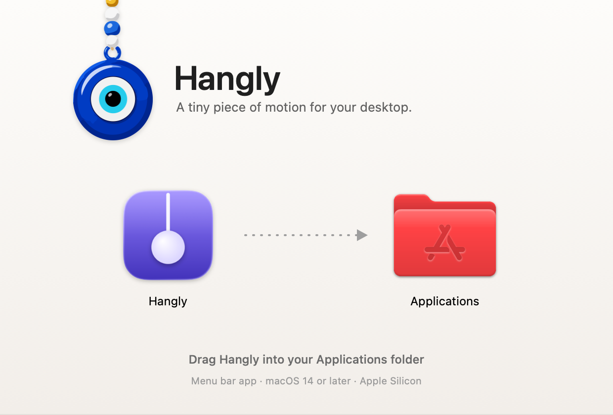
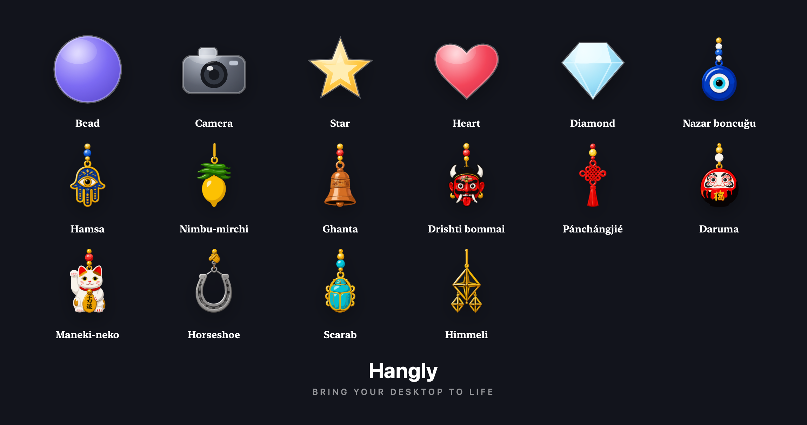

<div align="center">


# Hangly

**A tiny piece of motion for your desktop.**

A charm hangs from your menu bar on a simulated rope. Nudge it and it swings,
carries momentum, and settles — because it is real physics, not a looping
animation.

<br>

<a href="https://github.com/sharancreatedthis/Hangly/releases/latest/download/Hangly.dmg">
  
</a>

<sub>macOS 14 or later · Apple Silicon · 5.2 MB</sub>

<br>
<br>

[](https://github.com/sharancreatedthis/Hangly/actions/workflows/build.yml)
[](#requirements)
[](https://swift.org)
[](LICENSE)


</div>

---

## What it is

Hangly puts one small, beautiful object on your screen and then refuses to fake
it. The cord is a twenty-segment Verlet rope solved at a fixed 240 Hz. The beads
threaded above the charm are their own particles, riding the cord. Grab the charm,
throw it, and the momentum you gave it is the momentum it keeps.

It lives in the menu bar, has no Dock icon and no main window, and goes to sleep
when nothing is moving — because an ornament that costs you a fan spinning up is
not an ornament, it is a problem.

## Features

- **Real physics, not animation.** Verlet integration, distance-constraint
  relaxation, gravity and damping. No link ever stretches past 1.02× its rest
  length under any input you can give it.
- **Rope dynamics you can feel.** Fixed 240 Hz timestep, so the rope behaves
  identically at 60 Hz, 120 Hz and ProMotion's variable rates.
- **Interactive charms.** Grab, drag, throw. Release and the rope carries on at
  the speed you let go at.
- **Beads on the thread.** The beads above each charm are simulated particles with
  their own size, weight and spacing — they slide as the rope whips and settle back.
- **Sixteen charms.** Eleven from a hand-drawn collection of protective and lucky
  charms from around the world, plus five geometric classics.
- **Your own charms.** Drop any PNG, JPEG, WebP or HEIC onto the charm and the
  Studio removes its background, finds the subject, and hangs it on the rope.
- **Native SwiftUI and AppKit.** Swift 6 with strict concurrency. No frameworks,
  no dependencies, nothing vendored.
- **Genuinely cheap.** 0.6% of one core and 26 MB when settled, measured on the
  shipped build.

## Why Hangly exists

Desktops used to have texture. Not features — texture. A dashboard widget that
did nothing useful, a dock that bounced with more enthusiasm than the task
deserved, an easter egg someone left in a preferences pane. Software had slack in
it, and the slack is where personality lived.

Most of that is gone now, traded for density and speed. Which is mostly the right
trade. But something goes missing when every pixel is load-bearing: the screen you
stare at for nine hours a day stops feeling like a place and starts feeling like a
dashboard.

Hangly is one small argument against that. It does nothing. It is a charm on a
string, hanging off the top of your screen, obeying gravity. You can flick it on
the way past and watch it swing while you think.

The physics matter more than they should, and that is the whole point. A looping
GIF would have been an afternoon's work and would read as decoration — the eye
knows the difference between a thing that is drawn moving and a thing that is
moving. A real solver, sleeping when it settles and waking when you touch it,
reads as an object. That is the difference between an ornament on your screen and
an ornament in your room.

Designed and built by **sharancreatedthis** — photography, film, design, code.

## Screenshots

| The collection | Mid-swing |
|---|---|
|  |  |

| About | The installer |
|---|---|
|  |  |

<details>
<summary>The whole collection</summary>



</details>

## Requirements

- macOS 14 Sonoma or later
- Apple Silicon

Hangly is built `arm64`-only. Intel Macs are not supported today; see
[the roadmap](#roadmap).

## Installation

Download `Hangly.dmg` from [Releases](../../releases), open it, and drag Hangly to
Applications.

> **The first launch will be refused by Gatekeeper.** Hangly is not yet signed
> with an Apple Developer ID, so macOS will say the developer cannot be verified.
> Right-click the app and choose **Open**, then confirm — once. This is the honest
> state of a hobby project without a $99/year membership, not a sign something is
> wrong. Signing and notarisation are the first item on the roadmap.

Hangly appears in your menu bar. There is no Dock icon and no window — that is
expected. A fresh install adds itself as a login item; turn that off in
**Settings → General** if you would rather it did not.

## Building from source

```sh
git clone https://github.com/sharancreatedthis/Hangly.git
cd Hangly
open Hangly.xcodeproj
```

Select the **Hangly** scheme and press ⌘R. The project file is committed, so a
clean checkout builds with no generator or package manager.

From the command line:

```sh
xcodebuild -project Hangly.xcodeproj -scheme Hangly -configuration Debug build
xcodebuild -project Hangly.xcodeproj -scheme Hangly -configuration Debug test
```

To build what ships, including the disk image:

```sh
./Scripts/build-dmg.sh          # → dist/Hangly.app and dist/Hangly.dmg
```

There are three configurations. **Debug** for development; **Release** for
profiling, optimised but still carrying the debug overlay and diagnostic logging;
**Production** for distribution, with every development surface compiled out. See
[the distribution report](Docs/DISTRIBUTION.md) for what that means in detail.

## The physics engine

The rope is twenty segments and twenty-one nodes, anchored at the top and weighted
at the charm.

| | |
|---|---|
| Integration | Verlet — position and previous position, no velocity array |
| Timestep | Fixed 240 Hz, decoupled from the display rate |
| Constraints | Gauss-Seidel relaxation with an adaptive pass budget |
| Stretch ceiling | 1.02× rest length, enforced as a one-sided constraint |
| Sleep | After 60 still frames; nothing redraws until something moves |
| Cost | 0.02 ms per frame, about 0.3% of a 120 Hz budget |

Verlet was chosen over an explicit spring solver because it is unconditionally
stable at the constraint counts a rope needs, and because momentum survives a drag
release for free: releasing simply stops writing the position, and the gap the
drag left behind becomes the node's velocity.

Beads ride the cord as their own Verlet particles, projected back onto the curve
each step and tethered to the place the artwork drew them. The bead pass reads the
rope and writes only beads, so no amount of bead behaviour can disturb the rope's
own solver.

Full detail: **[Docs/Physics.md](Docs/Physics.md)**

## The SVG charm system

Each collection charm is one hand-drawn SVG: a cord, a few beads, then the charm.
Hangly takes it apart to hang it — the charm goes on the end of the rope and its
beads become separate physics particles.

The artwork is never edited. Where the beads end and the charm begins is *measured*
from the asset: a row crossed only by the cord is a few percent of the artwork's
width, a row through a bead or the charm is far wider, so the solid parts fall out
of the silhouette. At rest the result is laid out exactly as it was drawn.

Everything is rendered from vector at the display's real pixel density and cached
per size, so a charm is crisp on Retina at any scale.

Full detail: **[Docs/SVG-Import.md](Docs/SVG-Import.md)** and
**[Docs/Charm-System.md](Docs/Charm-System.md)**

## Performance

Measured on the shipped Production build, Apple Silicon, macOS 26:

| State | CPU | Memory |
|---|---|---|
| Settled | **0.6%** of one core | **26 MB** |
| Rope moving | ~15% of one core | 33 MB |
| Launch → on screen | ~210 ms | — |

The settled figure is the one that matters, because that is where Hangly spends
almost all of its life. When the rope stops moving the solver stops working, no
snapshot is published, SwiftUI never invalidates, and the canvas is never asked to
draw. The moving figure is dominated by the cost of redrawing a transparent window
at the display's rate rather than by anything in the simulation — emptying the
canvas entirely only saves about a third of it.

There are no filters anywhere in the render path. Blur and shadow filters
rasterise an offscreen layer every frame, and at 120 Hz that alone costs tens of
megabytes and a good share of a core. Everything is strokes, gradients and cached
bitmaps.

## Privacy

Hangly collects nothing. Not "anonymised" nothing — nothing.

- **No telemetry.** No usage reporting, no crash reporting, no phone-home.
- **No analytics.** Nothing counts what you do.
- **No tracking.** No identifiers, no fingerprinting, no profiles.
- **No network calls at all.** The binary links no networking framework and
  contains no request code. There is no setting to enable, because there is
  nothing to enable.
- **No accounts.** Nothing to sign into.

What stays on your Mac: your settings, in `~/Library/Preferences`, and any charms
you import, as image files in the app's own Application Support folder. Both are
plain files you can inspect or delete. Nothing leaves the machine.

Hangly ships unsandboxed, because a sandboxed app cannot register itself as a
login item from an arbitrary location. It requests no privacy-protected resource:
no camera, no microphone, no location, no contacts, no screen recording, no
accessibility permissions. You can verify all of this — the source is here.

## Roadmap

- [ ] Developer ID signing and notarisation, so the first launch is not a fight
- [ ] Universal binary for Intel Macs
- [ ] More charms, and a way to share them
- [ ] Multi-display behaviour beyond "follow the main screen"
- [ ] An Icon Composer icon, for macOS 26's icon shaping

## FAQ

Short version: it does not collect anything, it barely uses any CPU, and the
Gatekeeper warning on first launch is expected.

The longer answers, including why it is Apple Silicon only and what to do when the
rope will not grab, are in **[Docs/FAQ.md](Docs/FAQ.md)**.

## Contributing

Contributions are welcome. [CONTRIBUTING.md](CONTRIBUTING.md) covers the coding
standards, the pull request workflow and how to report an issue — in short: the
tests and SwiftLint must pass, comments explain *why*, and physics changes need a
test that would fail without them.

## Documentation

| | |
|---|---|
| [Architecture](Docs/Architecture.md) | How the app is put together, and why |
| [Physics](Docs/Physics.md) | The rope solver in detail |
| [Charm system](Docs/Charm-System.md) | Charms, the Library, the Studio |
| [SVG import](Docs/SVG-Import.md) | The artwork pipeline |
| [Distribution](Docs/DISTRIBUTION.md) | Build configurations, packaging, release checklist |
| [FAQ](Docs/FAQ.md) | Common questions |
| [Changelog](CHANGELOG.md) | What changed, and when |

## License

[MIT](LICENSE) for the code.

**The charm artwork is not covered by the MIT licence.** The eleven collection
SVGs in `Assets/Charms/`, the app icon, and the Hangly name and wordmark are
© 2026 sharancreatedthis, all rights reserved. You are welcome to build, fork and
modify the app; please do not redistribute the artwork as your own or ship a
competing build carrying this branding.

---

<div align="center">

Designed and built by **sharancreatedthis**

Photography • Film • Design • Code

</div>
